# Student Registration Form(Dynamic Website-LEMP Stack)
### Introduction

The Student Registration Form is a dynamic web application developed and deployed on an Amazon EC2 (Amazon Linux) instance using the LEMP Stack (Linux, NGINX, MySQL, PHP). The application allows users to submit their registration details through a web form, with the data securely stored in a MySQL database. This project provided hands-on experience in integrating the frontend, backend, and database while deploying a dynamic web application on AWS.
### Architechture Overview

* Amazon Linux (EC2)
* NGINX Web Server
* PHP->Backend
* MySQL Database
* HTML, CSS
* Linux Commands
* Bash Shell Scripting
### Features
* User registration form
* Data stored in database
* Dynamic data handling using PHP
* Server-side processing
* Accessible through server IP
## Steps I  Followed
1. Launch Amazon Linux Instance
* Created EC2 instance
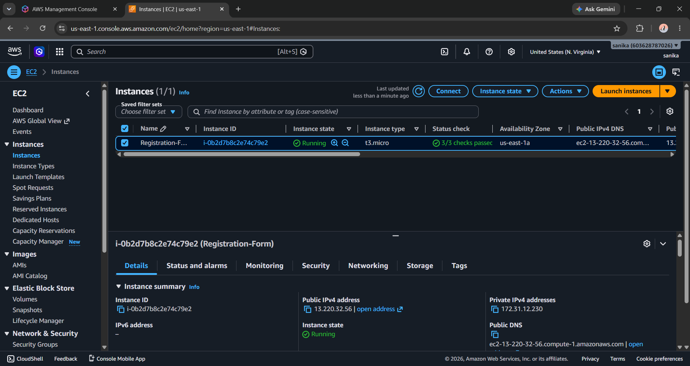
*  Connected using SSH
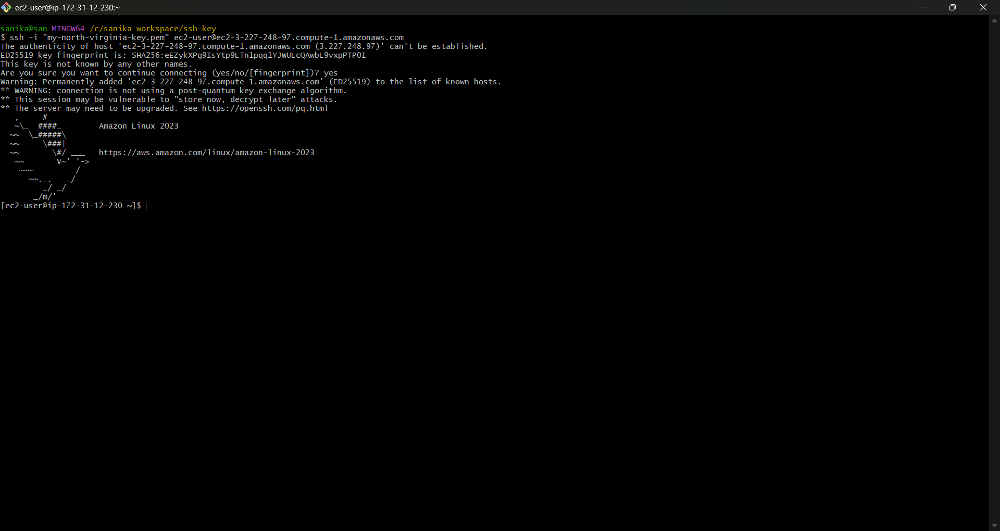

2. Changed the system hostname

sudo hostnamectl hostname registration-form
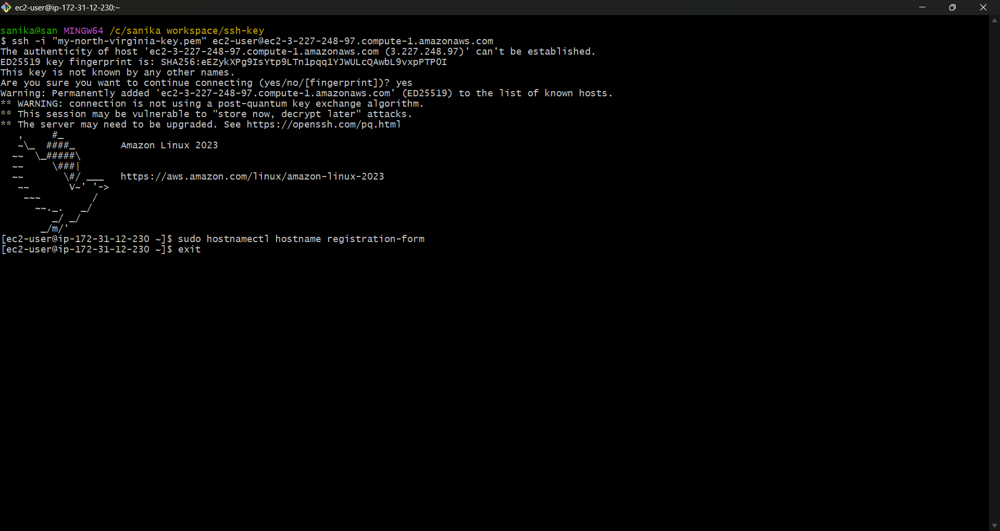

3. Created a Bash shell script (lemp.sh) using the Vim editor

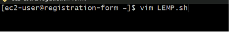

Opened the LEMP.sh file in the Vim editor and added the Bash commands to install, configure, and start the LEMP stack services. 

sudo yum update -y 
sudo yum install nginx mariadb105-server php -y  
sudo systemctl start nginx mariadb php-fpm 
sudo systemctl enable nginx mariadb php-fpm 

cd /usr/share/nginx/html/ 
echo "Hello from LEMP.sh file" > index.html
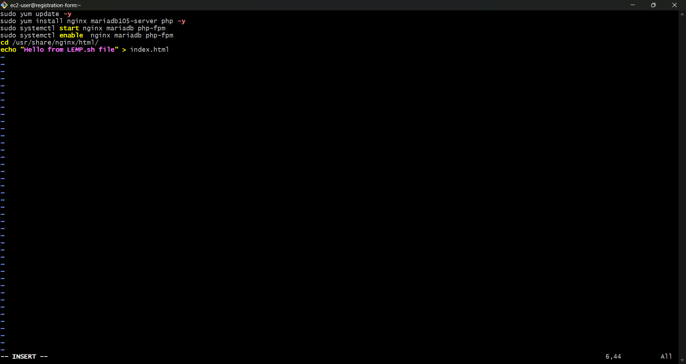

4. Execute the Bash Shell Script 

sudo bash LEMP.sh
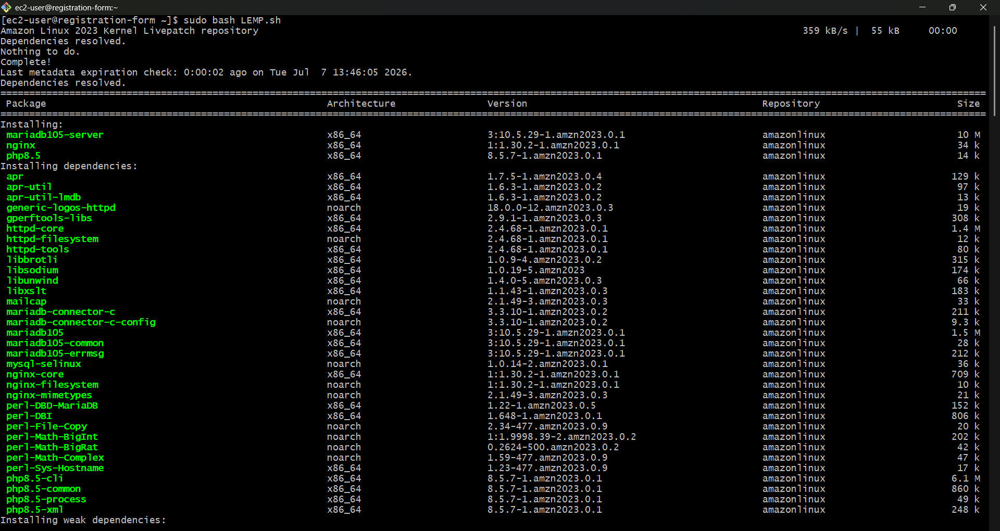

5. Verify the Status of LEMP Services

sudo systemctl status nginx mariadb php-fpm
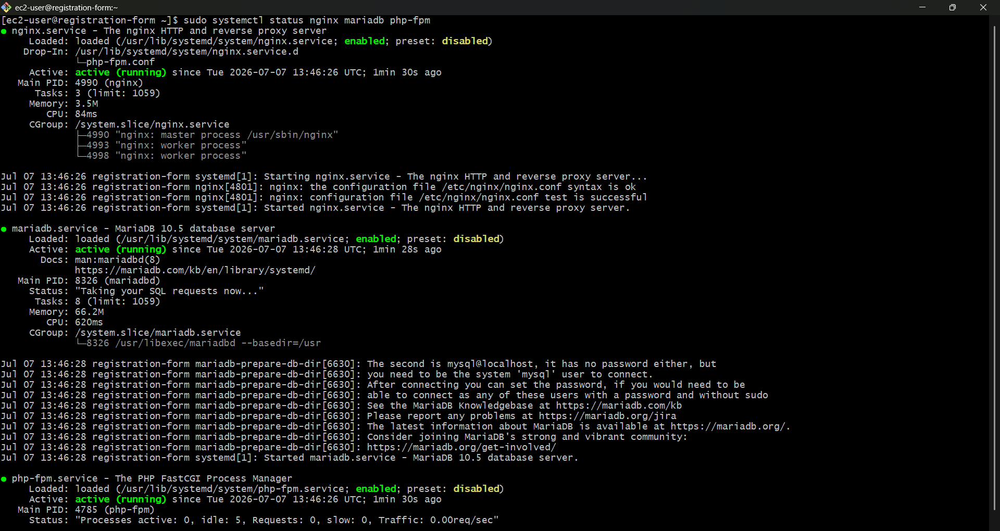

6. Create Project Files

* signup.html->for UI
* submit.php->for backend
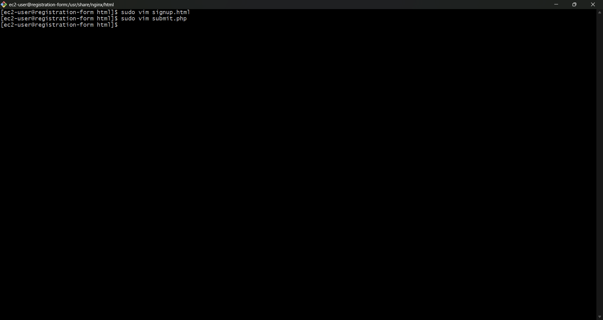

7. Setup Database

* Login To MySQL: 
mysql -u root -p

* Create database: 
CREATE DATABASE FCT;

* Create table: 
USE FCT;

CREATE TABLE users (
    id INT PRIMARY KEY AUTO_INCREMENT, 
    name VARCHAR(20), 
    email VARCHAR(100), 
    website VARCHAR(255), 
    gender VARCHAR(6), 
    comment VARCHAR(100) 
);
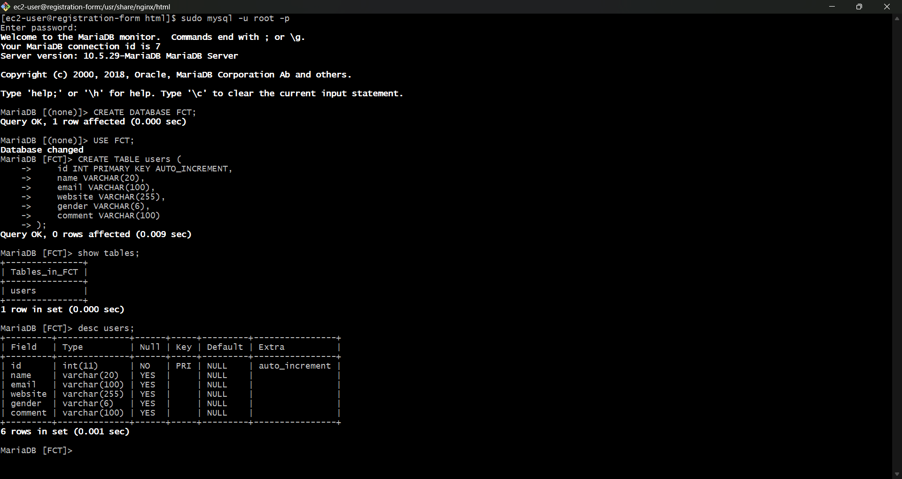

8. Download connector

sudo yum install php8.5-mysqlnd.x86_64 -y
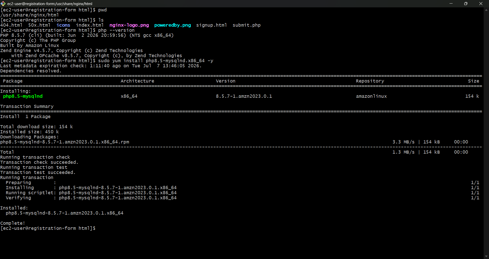

9. Access Website

* open browser 
* Enter EC@ public IP
* Fill The Form->Data stored in database
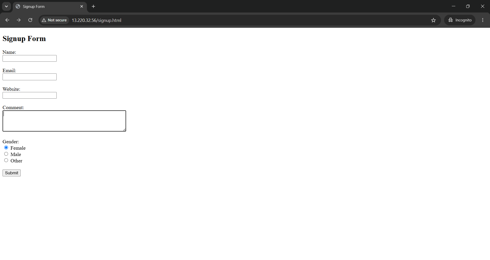
#
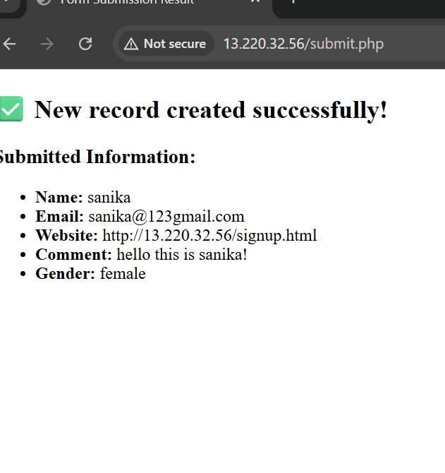

### What I Learned
* Deploying a dynamic web application on an AWS EC2 instance.
* Installing and configuring the LEMP Stack (Linux, NGINX, MySQL, PHP).
* Connecting a PHP application with a MySQL database.
* Managing Linux services using systemctl.
* Automating server setup using Bash shell scripting.
* Verifying application deployment and service status in a Linux environment.

### summary
This project provided hands-on experience in deploying a dynamic web application using the LEMP Stack on AWS. It enhanced my understanding of web server configuration, database integration, Bash shell scripting, and Linux server management while strengthening my practical DevOps and cloud deployment skills.

